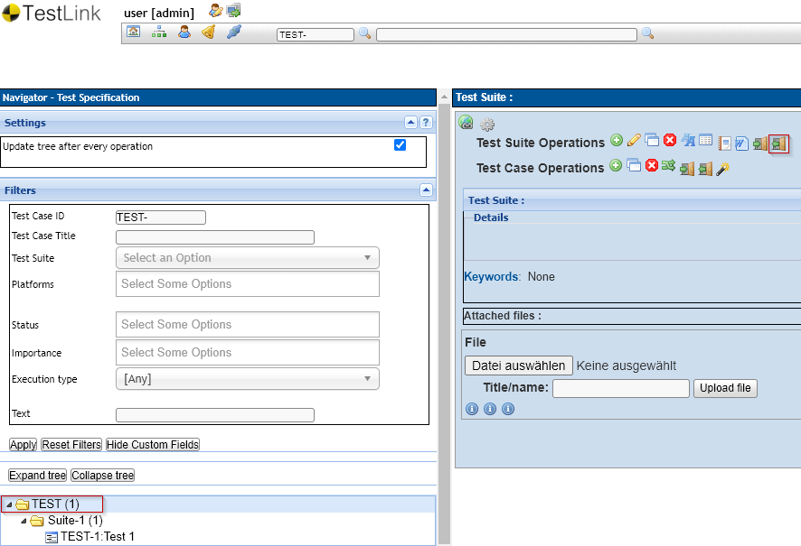
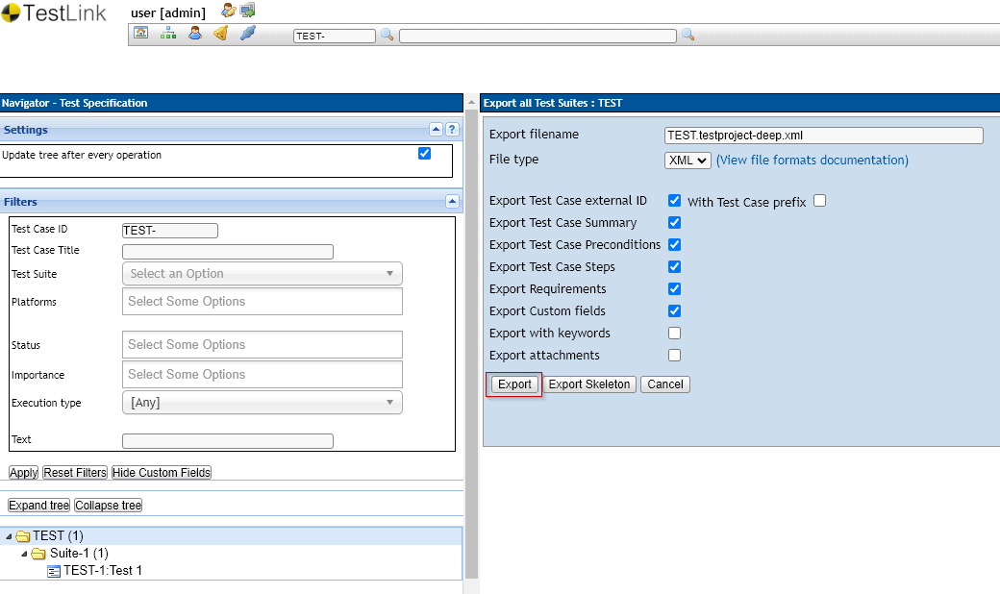

ifdef::env-github,env-gitea[]
:tip-caption: :bulb:
:note-caption: :information_source:
:important-caption: :heavy_exclamation_mark:
:caution-caption: :fire:
:warning-caption: :warning:
endif::[]

[[Top-of-the-page]]
= TestLink Migration to Klaros Test Management 
:toc: macro
:sectnums:

image:https://img.shields.io/badge/License-MIT-green[link="https://github.com/klaros-testmanagement/klaros-docker/blob/master/LICENSE"]
image:https://img.shields.io/badge/Community%20Edition-FREE-green[link="https://www.klaros-testmanagement.com/download"]
image:https://img.shields.io/twitter/follow/Klaros_TM?style=social[float="right", link="https://twitter.com/intent/follow?screen_name=Klaros_TM"]

toc::[]

== Introduction

This project offers scripts for importing test cases from https://github.com/TestLinkOpenSourceTRMS/testlink-code[TestLink]
XML export files to https://www.klaros-testmanagement.com/[Klaros Test Management].

=== About TestLink

TestLink is a web-based test management system that facilitates software quality assurance. It is developed and maintained by Teamtest. The platform offers support for test cases, test suites, test plans, test projects and user management, as well as various reports and statistics. 

=== About Klaros Test Management

https://www.klaros-testmanagement.com/[Klaros Test Management] is a professional web-based test management software.
It contains components for resource management and evaluation of test activity.
Tracking of test requirements is supported, as well as agile development processes.
Numerous interfaces with issue trackers, test automation tools and continuous integration servers allow
seamless integration into existing development environments.

Klaros Test Management is available free of charge in the https://www.klaros-testmanagement.com/download[Community Edition] and can also be used for commercial purposes without restrictions.

The https://www.klaros-testmanagement.com/download[Enterprise Edition] offers you the full range of functions,
including one-year support and free access to all software updates.
An overview of the features of both editions can be found
https://www.klaros-testmanagement.com/test-management/test-management-tool-comparison[here].

To receive your free 30-day trial license for the Enterprise Edition, you can request your license key https://www.klaros-testmanagement.com/trial[here].

Detailed information, extensive <<Documentation,documentation>> and a freely accessible
https://www.klaros-testmanagement.com/demo/pages/login.seam[online demo]
can be found under https://www.klaros-testmanagement.com/home[Klaros Test Management].

== Exporting a TestLink XML File

Export your TestLink test specification to XML format as shown below. You may start at any node in your tree.

 

Starting at the root node you get download a file like `TEST.testproject-deep.xml`.

 

== Importing a TestLink XML File

The import process consist of two steps:

. Transform the TestLink XML file to the Klaros import format using the provided style sheet `testlink2klaros.xsl`
. Upload the transformed file to the Klaros REST API

=== Transforming the TestLink XML File

The easiest way to transform the XML source via a style sheet is using the libxml library,which is available
as a package under Linux or Cygwin for Windows.

Other alternatives include XSLT processors like https://www.saxonica.com/download/download_page.xml[Saxon]
or https://xalan.apache.org/[Xalan].

[source, bash]
----
xsltproc testlink2klaros.xsl TEST.testproject-deep.xml > klaros-testcases.xml
----

=== Uploading the Transformed XML File

For uploading the result file to Klaros you may use the command line tool https://curl.se/[Curl] which
is available as a package under Linux or Cygwin for Windows.

Of course, using https://www.gnu.org/software/wget/[GNU wget] or any other tool for sending HTTP requests
is possible here as well.

[source, bash]
----
curl -v -T klaros-testcases.xml "http://localhost:18080/klaros-web/seam/resource/rest/import/testcase/xml?config=P0000X&username=admin&password=admin"
----

Please substitute 'P0000X' wwith the project id of the project you want to import to.
Likewise make sure to add the correct credentials in the username/password attributes.
The credentials must identify a user with role `Testmanager` for the above project. 

The import interface is described in detail in the
https://www.klaros-testmanagement.com/files/doc/html/User-Manual.Import-Export.html#User-Manual.Import-Export.Import-Testcases-From-XML[Klaros User Manual, Section "Importing Test Cases from XML"] 

IMPORTANT: Importing custom attributes
Importing custom attributes will only work, if the project already contains matching
custom field definitions.

This step is described in detail in the next section. 

=== Defining Custom Fields

As mentioned above, your Klaros project must already contain *all* custom field definitions
matching the custom fields of your TestLink project.
The name match is case-sensitive so the field names must match exactly.

For more information on creating custom field definitions, see the https://www.klaros-testmanagement.com/files/doc/html/User-Manual.Functions.Screen.html#User-Manual.Functions.Main.DetailsUserDefined[Klaros User Manual, Section User Defined Properties].

CAUTION: Custom field support is only available in the Klaros-Testmanagement Enterprise Edition.
If you are using the Community Edition, please disable the custom fields option for the TestLink export.

=== Scope and Limitations

The migration is able to transfer mostly all of the test case information, including step actions and expected results.

The following fields are currently not being transferred, as there is no directly matching field available in Klaros:

. Keywords
. Platform Information
. Test Case Relation
